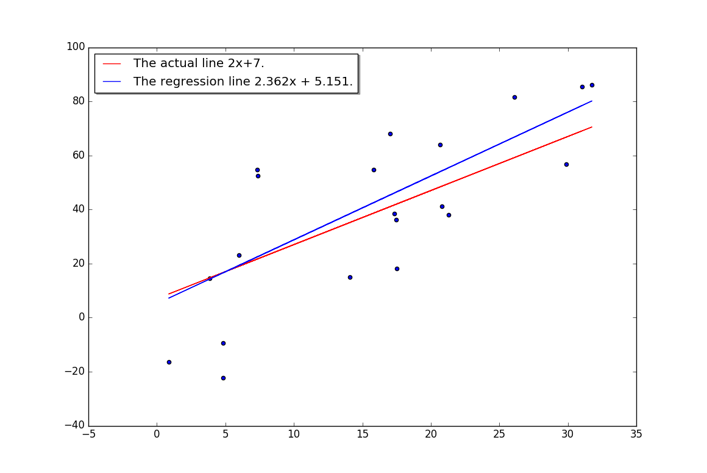
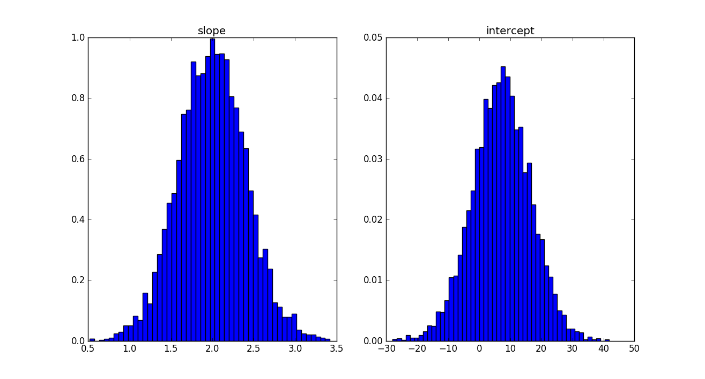

# pure-python-nn
A fully-connected, feed-forward neural net implementation in pure Python.
Written with Branton and his Spring 18 AI class.

Notes:
  * All code in this repo runs in pure Python 3. (In the experiments, you can uncomment some lines
    and produce graphs, if you happen to have [matplotlib](https://matplotlib.org/) installed, otherwise
    nothing outside the standard Python installation is needed.)
  * You can pull this entire repo to your computer using git by typing at the command
    line:
    ``` bash
    git clone http://github.com/sj-simmons/pure-python-nn
    ```
    Then issue the command `cd pure-python-nn` and run programs with, for example, `python3 experiment1.py`.
    Alternatively, you can run (and/or modify) the code in IDLE.

Code summary:
  * [feedforwardnn.py](feedforwardnn.py): The building blocks of a feed-forward neural net that trains
    via mini-batch gradient descent.
    Along with a function useful for training, the following classes are defined:
    * `Net` &mdash; the neural net, which is sequence of instances of the `Layer` class.
    * `Layer` &mdash; consisting of instances of the `Node` class.
    * `Node` &mdash; essentially a list of instances of `InputLink`.
    * `InputLink` &mdash; a small class with attributes `inputNode`, `weight`, and `partial`, instances of which connect the
      nodes from one layer to nodes the next layer in a net.

    Notes:
    * The inputs and outputs to an instance of `Net` are assumed to be lists of lists, one list for
      each example in the data set.
    * The `Net` class trains using mini-batch gradient descent.  Of course, you can recover stochastic gradient descent
      by setting `batchsize` = 1; or, batch gradient descent, by setting `batchsize` to the number of examples in your data.
    * Examples of instantiating the `Net` class:
      * `net = Net([8,1], activations = [None], loss = 'MSE')` &mdash; A linear model with 8 inputs, 1 output, no hidden layers,
         and mean-squared-error loss function.
      * `net = Net([15,1], activations = ['sigmoid'], loss = 'MSE )` &mdash; A model with 15 inputs, 1 output, no
         mean-squared-error loss but first applying the sigmoid function to the output.  This is a
         [logistic regression](https://en.wikipedia.org/wiki/Logistic_regression) model
         (see also [here](https://www.encyclopediaofmath.org/index.php/Logistic_regression)) and is often referred to as a
         [single-layered perceptron](https://en.wikipedia.org/wiki/Logistic_regression#As_a_single-layer_perceptron) network.
    * One trains an instance of the `Net` class using the `learn` method:
      ``` python
      for ...
          ...
          net.learn(xss, yss, learning_rate)
      ```
      where `xss` and `yss` are the inputs and outputs of batches of examples -- so lists of lists (of examples of the data).
    * In your training loop, you must zero out the gradients before learning:
      ``` python
      for ...
          ...
          net.zeroGrads()
          net.learn(xss, yss, learning_rate)
      ```
    * A `train` function is also provided (in [feedforwardnn.py](feedforwardnn.py)).
      ``` python
          train(net, xss, yss, batchsize, epochs, learning_rate)
      ```
      where `net` is an instance of the `Net` class.

    TODO:
    * ~~Implement mini-batch gradient descent~~.
    * Implement learning rate decay.
      * It might be best to implement this exterior to `Net` class.  The `learn` method in accepts the learning
        rate as a parameter that can be changed on the fly (while training).
    * Implement a single hidden layer.
    * Implement multiple outputs and softmax/logsoftmax.
    * Implement a multiple hidden layers.
    * Implement bias nodes in 2nd, 3rd, ... hidden layers.
  * [activationandlossfns.py](activationandlossfns.py): Provides various nonlinearities as well as loss functions.
  * [liststats.py](liststats.py): This is small library of functions, written in pure Python,
    that are useful, for example, for mean-centering and normalizing data in the form of lists of lists.

Neural net examples:
  * [climate_temp_model.py](climate_temp_model.py) &mdash; A global average climate temperature model that trains on these data:
    [temp_co2_data.csv](datasets/temp_co2_data.csv).
  * [titanic_sigmoid.py](titanic_sigmoid.py) &mdash; Predicts survival after training on numeric versions of Branton's version of the
    Titanic datasets.
  <!--* [housing_model.py](housing_model.py) &mdash; A housing valuation model based on the Ames, Iowa housing data set: [AmesHousing.csv](datasets/AmesHousing.csv).-->

Data sets:
  * [temp_co2_data.csv](datasets/temp_co2_data.csv) &mdash; some global climate data.
  * [titanic_train.csv](datasets/titanic_train.csv) &mdash; Branton's original Titanic training set.
  * [titanic_test.csv](datasets/titanic_test.csv) &mdash; Branton's original Titanic test set.
  * [titanic_numeric_train.csv](datasets/titanic_numeric_train.csv) &mdash; same as Branton's original training set but with numeric fields.
  * [titanic_numeric_test.csv](datasets/titanic_numeric_test.csv) &mdash; same as Branton's original test set but with numeric fields.
  * [titanic_to_numeric.py](datasets/titanic_to_numeric.py) &mdash; this was used to generate the *numeric* versions. (Uses `pandas`.)

Experiments:
  * [experiment1.py](experiment1.py) &mdash; generates data appropriate for linear regression on uses an instance of the
    `Net` class in [feedforwardnn.py](feedforwardnn.py) to find the least-squares regression line for the data.  In case you
    do not have installed [matplotlib](https://matplotlib.org/), here is its output:

    <p align="center">
      
    </p>

  * [experiment2.py](experiment2.py) &mdash; runs experiment1 many times and tabulates and analyses the mean and variation
    of the slopes and standard deviations of the resulting regression lines.

    <p align="center">
      
    </p>
